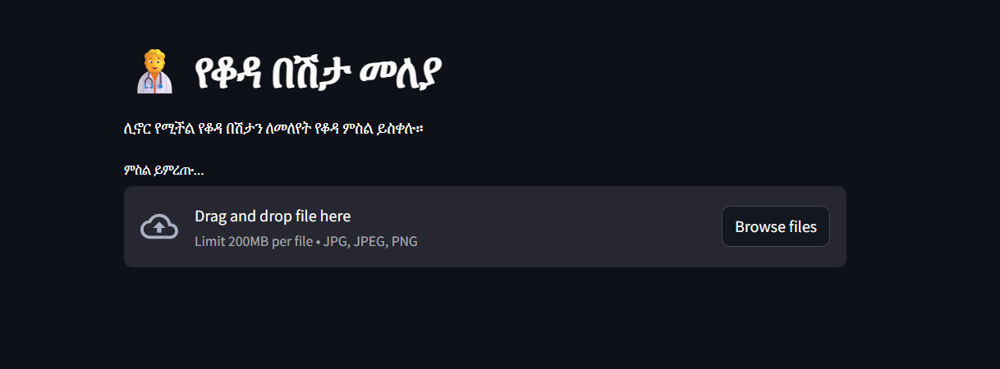
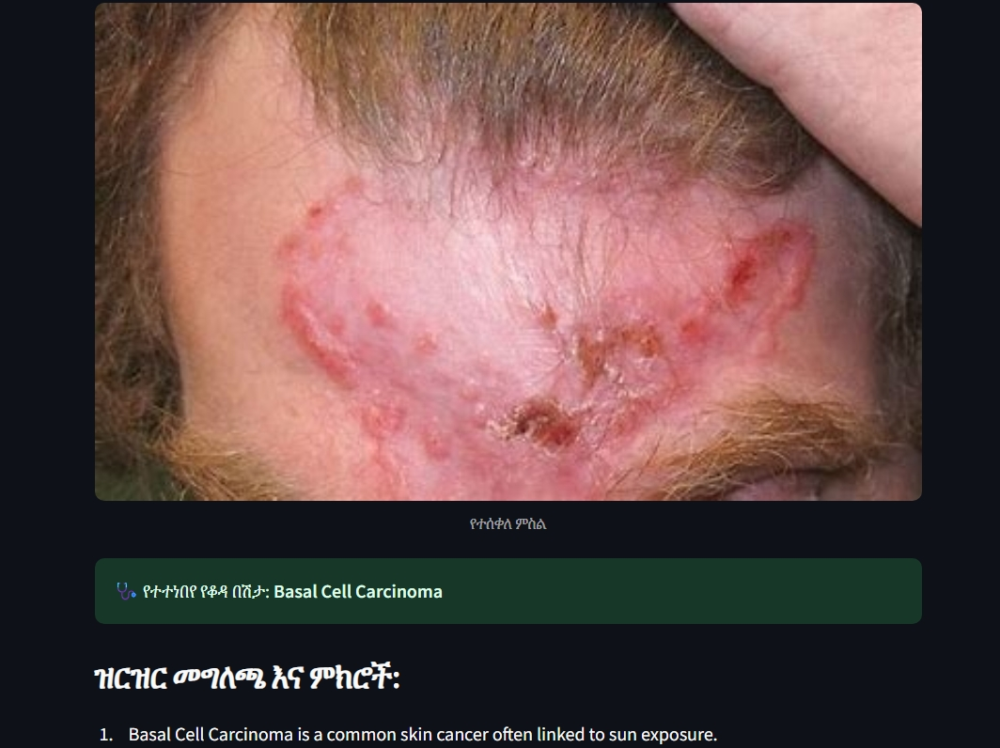
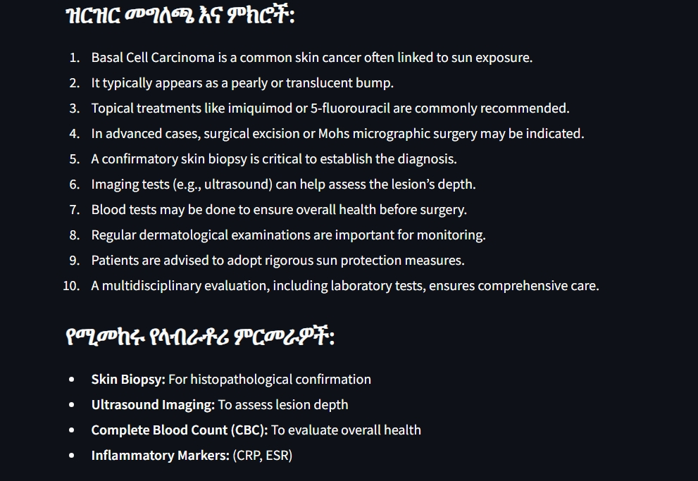

# የቆዳ በሽታ መለያ** ፕሮጀክት**

ይህ ፕሮጀክት በምስል ላይ ሊኖር የሚችለውን የቆዳ በሽታ ለመለየት የተሰራ ነው። በDINOv2 ሞዴል ላይ ተመስርቶ የቆዳ ምስሎችን በመጠቀም የበሽታውን አይነት ለመተንበይ ይረዳል።

## ይዘት

* [መግቢያ](#መግቢያ)
* [መስፈርቶች](#መስፈርቶች)
* [installation](#መገጣጠም)
* [አጠቃቀም](#አጠቃቀም)
* [የምሳሌ ውጤቶች](#የምሳሌ-ውጤቶች)
* [ስለ DINOv2 ሞዴል](#ስለ-dinov2-ሞዴል)
* [ፕሮጀክቱ እንዴት ይሰራል?](#ፕሮጀክቱ-እንዴት-ይሰራል)
* [ውጤቶቹ ምን ያህል ትክክል ናቸው?](#ውጤቶቹ-ምን-ያህል-ትክክል-ናቸው)
* [የፕሮጀክት ማበልጸጊያ](#የፕሮጀክት-ማበልጸጊያ)

## መግቢያ

ይህ መተግበሪያ ተጠቃሚዎች የቆዳ ምስል እንዲሰቅሉ እና ሊኖር የሚችለውን የቆዳ በሽታ ትንበያ እንዲያገኙ ያስችላል። ትንበያው የሚካሄደው በቅድመ-ስልጠና በተሰጠው እና ለቆዳ በሽታዎች በተስተካከለ (fine-tuned) የDINOv2 ሞዴል ነው። ከተተነበየው የበሽታ ስም በተጨማሪ ዝርዝር መግለጫ እና የሚመከሩ የላብራቶሪ ምርመራዎች (መረጃው ካለ) ይሰጣል።

## መስፈርቶች

ፕሮጀክቱን ለማስኬድ የሚከተሉት ያስፈልጋሉ፦

* Python 3.x
* Streamlit
* PyTorch
* Transformers library (Hugging Face)
* Pillow (PIL)

እነዚህን መስፈርቶች ለመጫን `pip` መጠቀም ይችላሉ፦

```
pip install streamlit torch transformers pillow

```

## installation

1. ይህንን ሪፖዚቶሪ ክሎን ያድርጉ፦
   ```
   git clone [የሪፖዚቶሪዎ_ዩአርኤል]
   cd Skin-Disease-Classifier-Project

   ```
2. የሚያስፈልጉትን ላይብረሪዎች ይጫኑ (ከላይ ይመልከቱ)።
3. ያሰለጠኑትን ወይም ለመጠቀም ያሰቡትን የDINOv2 ሞዴል [path/to/your/finetuned/dinov2/model] በሚለው ቦታ ያስቀምጡ።

## አጠቃቀም

መተግበሪያውን ለማስኬድ የሚከተለውን ትዕዛዝ ይጠቀሙ፦

```
streamlit run skin.py

```

(የዋናው የፓይዘን ፋይል ስም `skin.py` ነው)

ይህ ትዕዛዝ የድር አሳሽ ይከፍታል እና መተግበሪያውን ያሳያል።

1. "ምስል ይምረጡ..." የሚለውን ቁልፍ በመጫን የቆዳ ምስል ይስቀሉ።
2. ምስሉ ከተሰቀለ በኋላ መተግበሪያው በራስ-ሰር ትንበያውን ያከናውናል።
3. የተተነበየው የበሽታ ስም፣ ዝርዝር መግለጫ እና የሚመከሩ የላብራቶሪ ምርመራዎች (መረጃው ካለ) ይታያል።

የመተግበሪያው ዋና ገጽ ቅጽበታዊ ገጽ እይታ

## የምሳሌ ውጤቶች

አንድ ምስል ሲሰቅሉ ውጤቱ ይህንን ሊመስል ይችላል፦




መተግበሪያው በሽታውን ሲተነብይ የሚያሳይ ምሳሌ




የተተነበየ የቆዳ በሽታ እና ዝርዝር መግለጫ የሚያሳይ ምሳሌ




## ስለ DINOv2 ሞዴል 🧠

ይህ ፕሮጀክት የቆዳ በሽታዎችን ለመለየት **DINOv2** የተባለውን የኮምፒዩተር ቪዥን ሞዴል ይጠቀማል። DINOv2 በMeta AI የተሰራ ሲሆን በብዙ ምስሎች ላይ የሰለጠነ በመሆኑ ለተለያዩ የቪዥን ተግባራት ጠቃሚ የሆኑ ባህሪያትን መማር ይችላል። እዚህ ላይ ለቆዳ በሽታ መለያ በተለየ መልኩ እንዲሰራ ተደርጎ ተስተካክሏል። ስለ DINOv2 ተጨማሪ መረጃ በHugging Face [እዚህ](https://huggingface.co/facebook/dinov2-base "null") ያገኛሉ።

## ፕሮጀክቱ እንዴት ይሰራል? 🛠️

1. **ምስል መስቀል:** ተጠቃሚው የቆዳውን ምስል በመተግበሪያው ላይ ይሰቅላል።
2. **ቅድመ-ዝግጅት:** የተሰቀለው ምስል ሞዴሉ ሊረዳው በሚችል ቅርጸት ይዘጋጃል።
3. **ትንበያ:** ቅድመ-ዝግጅት የተደረገው ምስል ወደ DINOv2 ሞዴል ይላካል እና ሞዴሉ ሊኖር የሚችለውን የቆዳ በሽታ ይተነብያል።
4. **ውጤት ማሳየት:** መተግበሪያው የተተነበየውን የበሽታ ስም፣ አጭር መግለጫ እና ሊያስፈልጉ የሚችሉ የላብራቶሪ ምርመራዎችን ያሳያል።

## ውጤቶቹ ምን ያህል ትክክል ናቸው? ✅

ይህ ፕሮጀክት የህክምና ባለሙያዎችን ስራ ለማገዝ እና ሊኖር የሚችለውን የቆዳ በሽታ በፍጥነት ለመለየት እንዲረዳ ታስቦ የተሰራ መሳሪያ ነው። የዚህ ፕሮጀክት ትንበያዎች በሰለጠነው የDINOv2 ሞዴል አፈጻጸም ላይ የተመሰረቱ ናቸው። ሞዴሉ በጥሩ ሁኔታ የሰለጠነ ከሆነ ትክክለኛ የመሆን እድሉ ከፍተኛ ነው። **ሆኖም፣ ይህ መተግበሪያ ለህክምና ምክር ወይም ለሙያዊ ምርመራ ምትክ አይደለም።** ለማንኛውም የቆዳ ሁኔታ ትክክለኛ ምርመራ እና ህክምና ለማግኘት ሁልጊዜ ብቃት ያለው የህክምና ባለሙያ ማማከር አስፈላጊ ነው።

## የፕሮጀክት ማበልጸጊያ 🚀

ይህንን ፕሮጀክት የበለጠ ለማሻሻል እና ለማልማት የሚከተሉትን ነጥቦች ግምት ውስጥ ማስገባት ይቻላል፦

* **ሞዴል ማሰልጠን እና ማስተካከል:** የራስዎን የቆዳ በሽታ መለያ ሞዴል ለማሰልጠን ወይም አሁን ያለውን የDINOv2 ሞዴል በተሻለ የውሂብ ስብስብ ላይ በማስተካከል የትንበያውን ትክክለኛነት ማሳደግ ይቻላል።
* **የውሂብ ስብስብ ማበልጸግ:** የሞዴሉ አፈጻጸም በጥራት እና በመጠን ላይ የተመሰረተ ነው። ትልቅ እና የተለያዩ የቆዳ በሽታ ምስሎች ስብስብ መሰብሰብ እና ማደራጀት ለተሻለ ውጤት ወሳኝ ነው።
* **ተጨማሪ ባህሪያት መጨመር:** የመተግበሪያውን ጠቀሜታ ለመጨመር እንደ በርካታ የበሽታ አይነቶችን መደገፍ፣ ተጠቃሚዎች ስለ ትንበያው አስተያየት እንዲሰጡ መፍቀድ፣ ወይም ከህክምና ተቋማት ጋር ማገናኘት ያሉ አማራጮችን ማከል ይቻላል።
